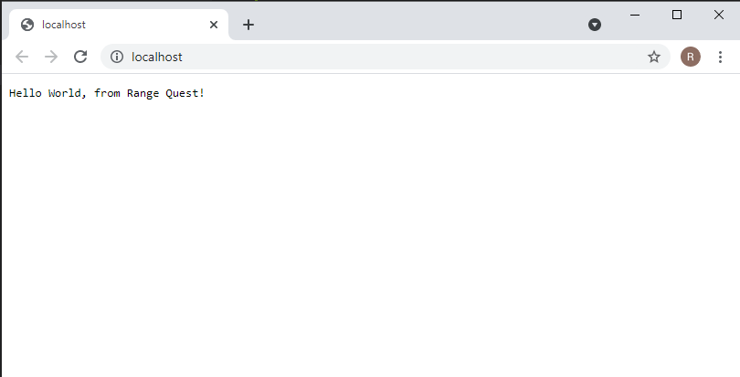

# RANGE QUEST Docker Image

Docker Image on Docker Hub
https://hub.docker.com/r/rangequest/rq-docker-image

Pull the image
`docker pull rangequest/rq-docker-image`

Run a container
`docker run -d --name rq_container -p 80:3000 rangequest/rq-docker-image:v1.0.0`

http://localhost:8080/

## To build the Docker Image from Dockerfile

`git clone https://github.com/rangequest/rq-docker-image.git`

`docker build --tag rangequest/rq-docker-image:v1.0.0 .`

## Docker Hub

https://hub.docker.com/

